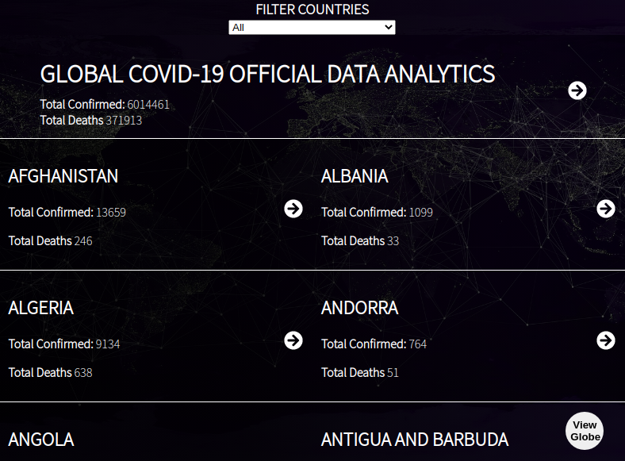

# Covid-19 Stats

On January 2020, a virus outbreak emerged infecting people all over the world. Having an awareness about the virus spread can play a big role in ensuring your safety. For example, it can help you decide wheather it is safe to visit a specific country/area or not. Covid-19 stats come in to solve this problem. It fetches current official data from [Covid-19 official data free API](https://covid19api.com/) and allows one to view and filter data for specific countries. Onother interesting feauture is that you can be able to visualize the spread on the globe. Thanks to [react-globe-gl](https://github.com/vasturiano/react-globe.gl).

The live version can be found [here](https://official-covid-19-stats.netlify.app).

## :package: Built With

    - React.js
    - Redux
    - react-globe.gl

## :computer: Getting Started

    To get a local copy up and running follow these simple steps.

## :arrow_heading_down: Install

1) Clone the repository to your local machine
```sh
$ git clone https://github.com/wathigo/covid-19-stats.git
```

2) cd into the directory
```sh
$ cd covid-19-stats
```

3) install dependencies 
```sh
npm install
```
or if you are using yarn:
```sh
yarn install
```

Start the development server
```sh
npm start
```
or with yarn:
```sh
yarn start
```

## :arrow_forward: Usage

Ypu will be redirected to `localhost:3000` after starting the development server.
After this, you will get to the home page of the applications containing unfiltered world covid-19 statists.
<p align="center">
<a href="#">
    
  </a>
</p>

## :vertical_traffic_light: Testing
No tests for this project


## :busts_in_silhouette: Authors

👤 **Simon Wathigo**

- Linkedin: [Simon Wathigo](https://www.linkedin.com/in/simon-wathigo/)
- Github: [@wathigo](https://github.com/wathigo)

## 🤝 Contributing

    Contributions, issues and feature requests are welcome!

Feel free to check the [issues page](../../issues).

## :star2: Show your support

    Give a ⭐️ if you like this project!

